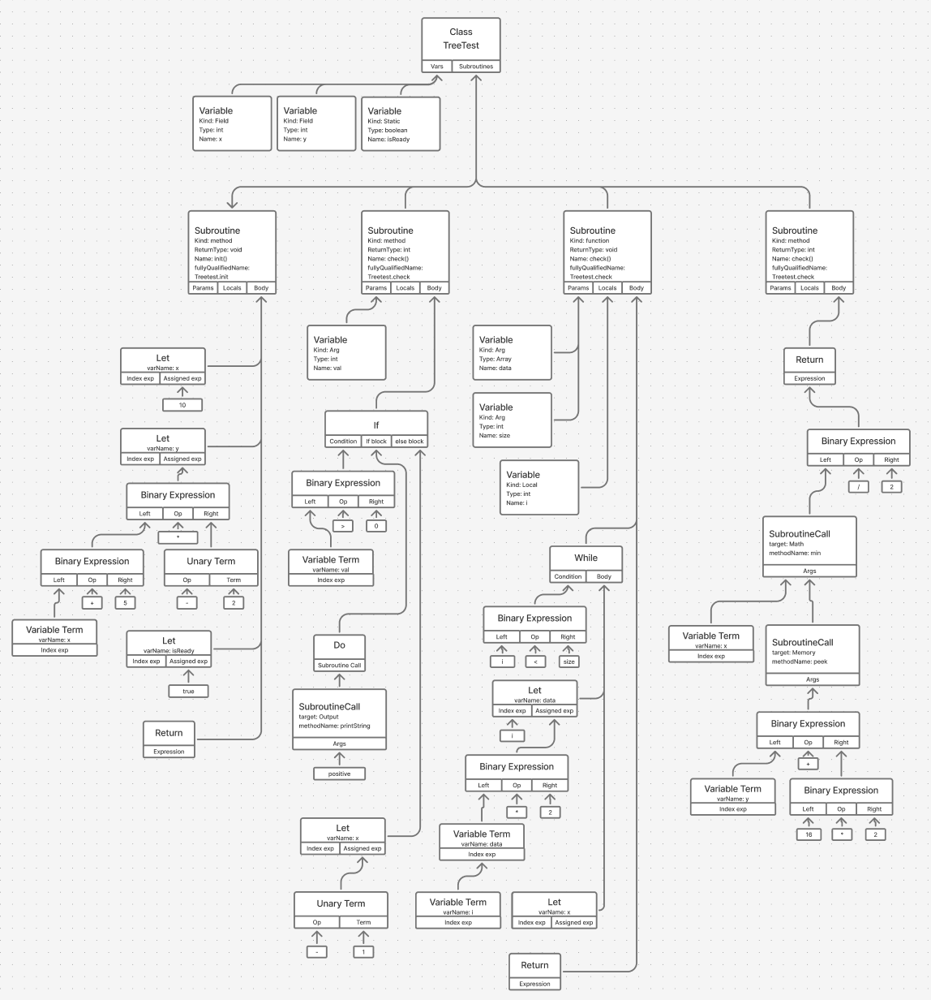

```
class TreeTest {
    field int x, y;
    static boolean isReady;

    method void init() {
        let x = 10;
        let y = (x + 5) * -2;
        let isReady = true;
        return;
    }

    method int check(int val) {
        if (val > 0) {
            do Output.printString("Positive");
        } else {
            let x = -1;
        }
        return x;
    }

    function void loop(Array data, int size) {
        var int i;
        let i = 0;
        while (i < size) {
            let data[i] = data[i] * 2;
            let i = i + 1;
        }
        return;
    }

    method int complex() {
        return Math.min(x, Memory.peek(y + (16 * 2))) / -5;
    }
}
```


